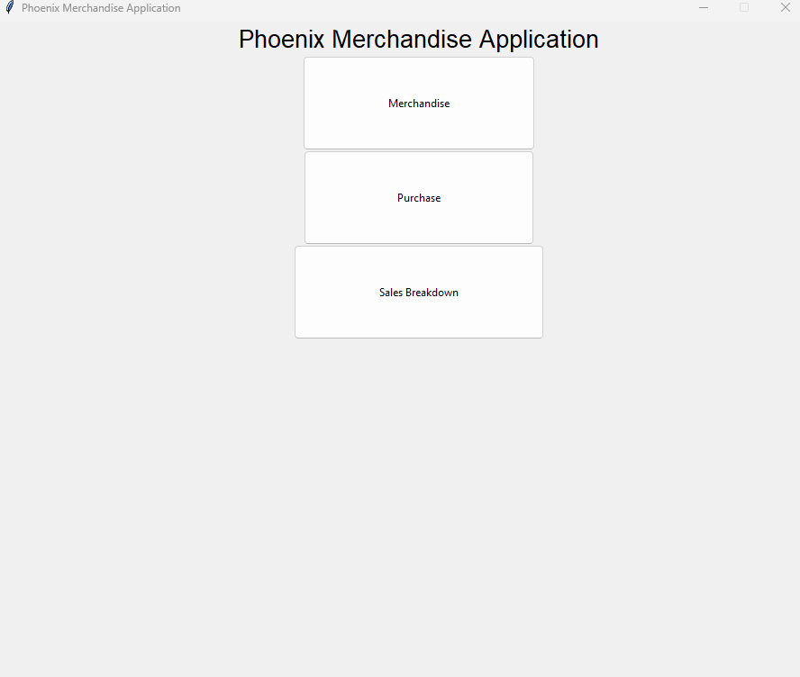
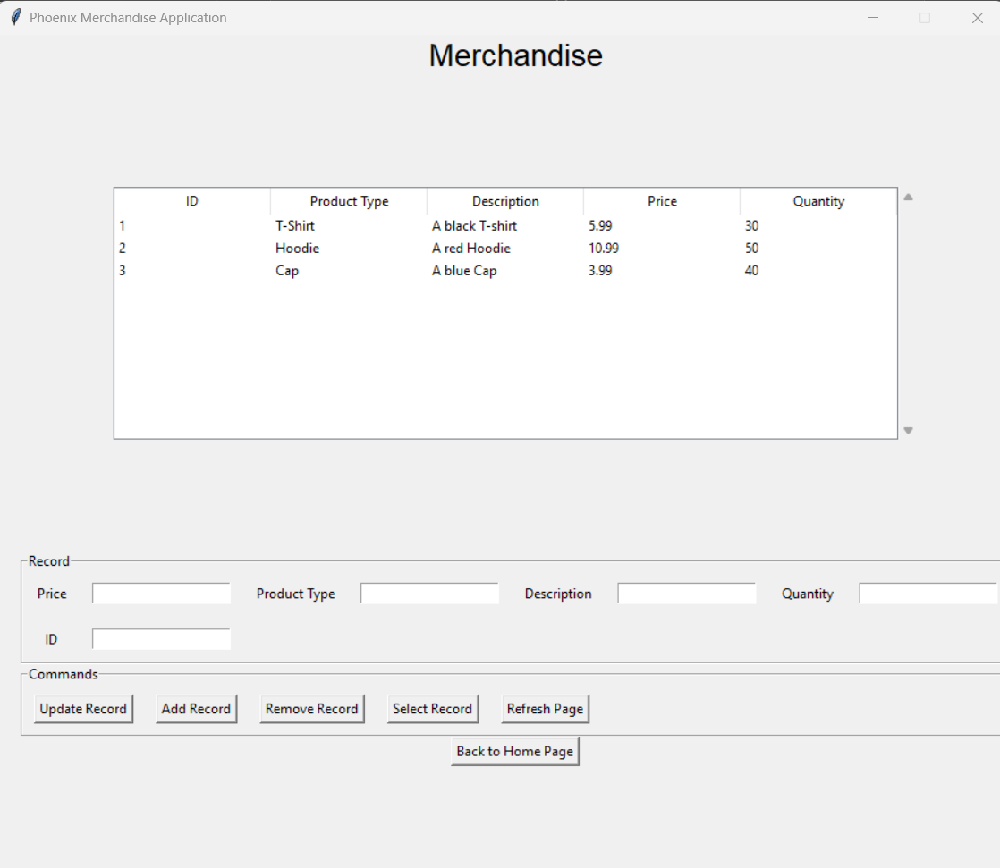
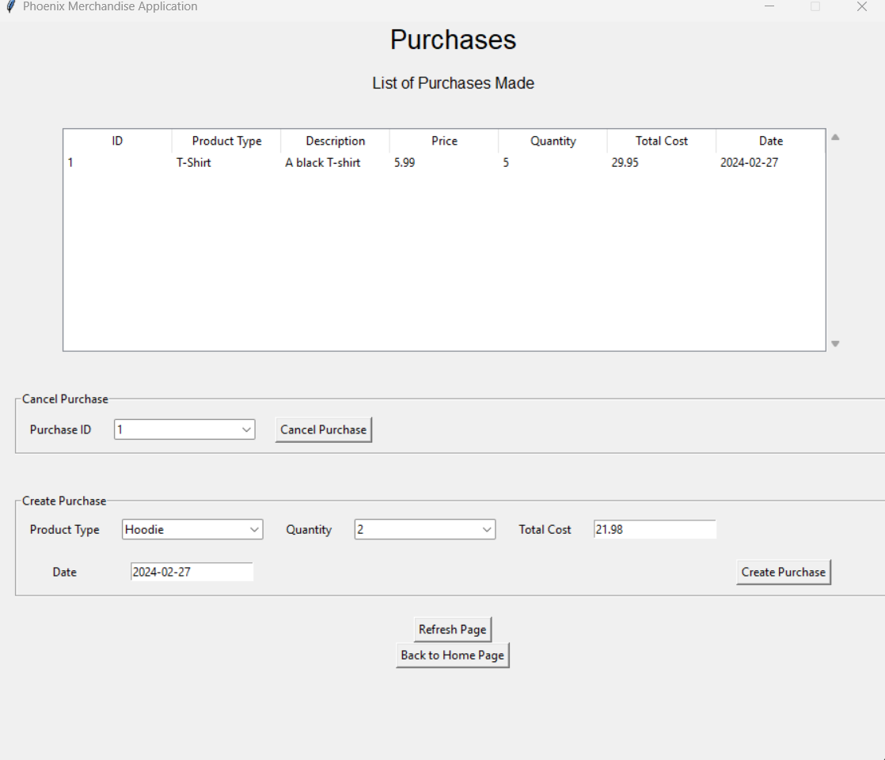
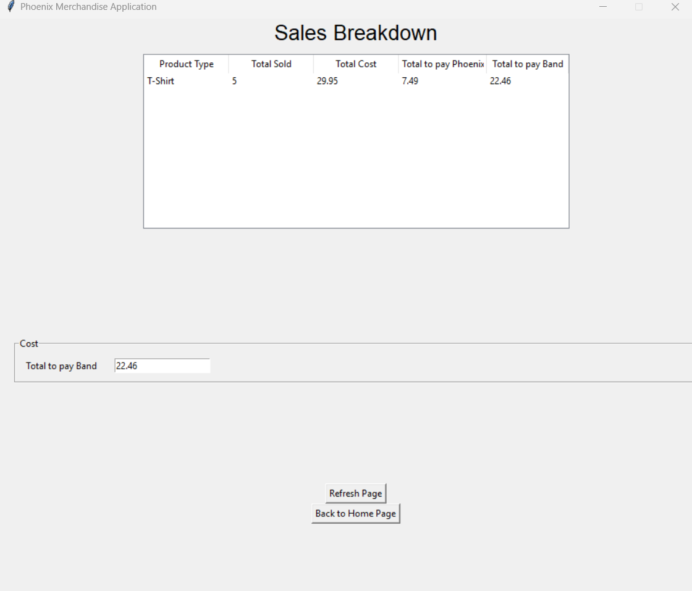
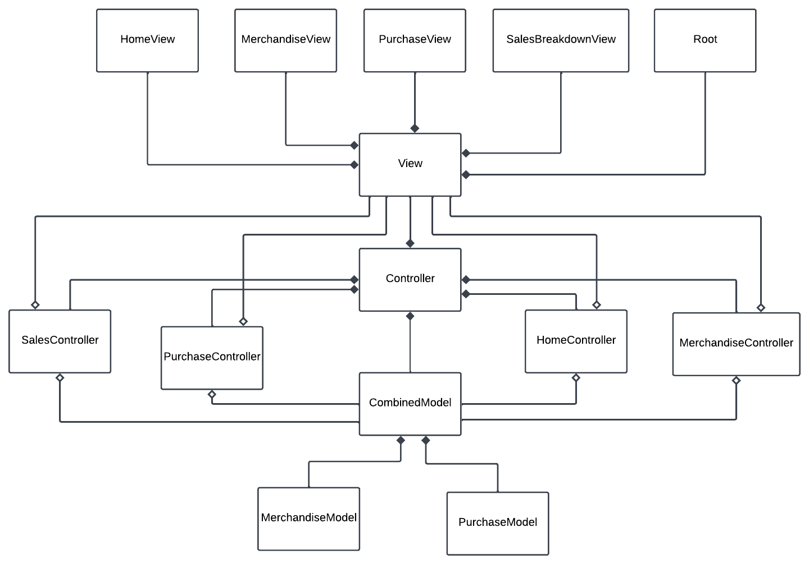

# Phoenix Merchandise Application

## Table of Contents
 - [Application Description](#item-one)
 - [Setup Instructions](#item-two)
 - [Usage Instructions](#item-three)
 - [Software Architecture](#item-four)
 - [References](#item-five)
 
 <!-- headings -->
 
 ## Application Description

The Phoenix Merchandise Application's purpose is to be used by Phoenix, the Concert Merchandising Concession company, to provide the sales function for touring bands at certain concert venues around the country.

The application provides 3 main functions:

1) Loading in Concert Merchandise for Phoenix to sell
2) Creating Purchases for Merchandise sold to customers at concerts
3) Viewing a breakdown of sales for Merchandise sold

This application can be used by Phoenix Managers and Sales Staff to first load in Merchandise stock at the start of the day and then sell this Merchandise throughout the day, then finally at the end of the day reviewing a breakdown of the stock sold.

The application allows the user to do the following tasks:
- View, Add, Update and Delete Merchandise stored in the Phoenix Database
- View, Create and Cancel Purchases made for merchandise
- View a breakdown of the amount sold for each piece of merchandise and the total to pay the touring band and the commission made by Phoenix

 <!-- headings -->
 
Installation and Setup Instructions
------------------------------------

To run the Phoenix Merchandise Application on your local computer, please follow the steps below:
 (These steps assume that you have received a zipped copy of the project)

 Installation:

 * Ensure Visual Studio Code is installed on your computer
 * Ensure Python 3.10+ is installed on your computer
 * Ensure you have a Python Plugin installed in Visual Studio Code

Optional Plugins:

* Flake8 Plugin - so you can see flake8 errors
* vscode-pdf - so you can view the pdf files in vscode

 Setup:

 1) Unzip the project and save in an easily accessible location your computer
 2) Open the unzipped project into Visual Studio Code
 3) Create a virtual environment and activate it by following these commands:

    * In your terminal run::

        `python -m venv .env`

    * The cd into .env then cd into Scripts and run the following command to activate your virtual environment::

        `.\activate` 

4) Once your virtual environment is activated, you can run the command to install the requirements::

        pip install -r requirements.txt

Running the Application:

1) From the Project Directory (phoenix-app), cd into mycode
2) Then once you're in the mycode directory and you're in your virtual environment, run the command::

      `python main.py`

 Running Tests:

 1) To run the unit tests for this project, cd into mycode and run the command:

    `python -m pytest --cov=. tests/`
2) To run the unit tests for specific modules, cd into mycode/tests and run the command:

    `python -m pytest .\<filename>`

    For example:
    `python -m pytest .\test_purchase_model.py`
    
2) After running the unit tests, remember to delete any temporary databases created
3) To test the frontend, use the User Acceptance Testing document in the tests folder. Work through each statement, to check that the application performs that action

How to use the Application
---------------------------

For instructions on how to use the application and it's features, please refer to the pdf documentation under the documents folder. This details with pictures how to use the different features of the application step by step.

### Usage Instructions

Below are a set of instructions which will guide all users (Managers, Sales Staff and Software Developers) on how to use the application.

When you first run the application, you will see the Home Page.

From this page you can click which page you would like to visit using the buttons.

1) Merchandise Page

    When you click the Merchandise button, you are taken to the Merchandise page. This is where managers can load in merchandise at the start of the day and Sales Staff can view the merchandise they have in stock.

    

    The table shows all the existing records in Phoenix database for merchandise that has been loaded in. Below are some instructions to complete common actions:

    Select a record:

    1) Click the record in the table you want to Select (it will turn blue once selected)
    2) Click the "Select Record" button in the Commands section 

    Delete a record:

    1) Follow the steps above to select the record you want to remove
    2) Press the "Remove Record" button in the Commands section and you will see it be removed from the table

    Update a record:

    1) Follow the steps above the select the record you want to update
    2) Edit the fields after they have been populated in the boxes below the table
    3) Don't edit the ID field
    4) Once you have changed the fields, press the "Update Record" button

    Add a record:

    1) Fill the entry boxes below the table with the item you want to add
    2) Do not fill in the ID field as that it automatically generated when added to database
    3) Once you have populated the boxes, press the "Add Record" button to add the record

2) Purchase Page

    If you click the Purchase Button from the Home Page, you will be taken to the Purchase Page.

    The Purchase Page is where Sales staff can create Purchases. You can also view past purchases made and cancel purchases.

    

    To create a Purchase:

    1) In the "Create Purchase" Section click the Drop down button for Product Type to select the product to purchase
        * If you can't see a particular product, press the "Refresh" button and try again
    2) Once you have selected the Product Type, click the drop down button for Quantity and select the quantity to purchase
    3) Then the next two fields will auto populate with the price and today's date
    4) Then click "Create Purchase" to create the Purchase and it will appear in the table at the top

    To cancel a Purchase:

    1) In the "Cancel Purchase" section, click the drop down button to select the Purchase ID of the Purchase you want to cancel
        * If you can't see your particular purchase, press the "Refresh" button and try again
    2) Once you have selected the Purchase ID, click the "Cancel Purchase" button and you will see it removed from the top

3) Sales Breakdown Page

    If you click the Sales Button on the Home Page, you'll be taken to the Sales Breakdown Page.

    This page displays, by product in the Merchandise table, the total sold for each product and the amount to be paid to the touring band and the amount that Phoenix gets to keep as commission.

    This page can be used by managers to track the breakdown of sales per product.

    

IMPORTANT:

For all the pages, sometimes the application takes a while to update for new changes in data. To update the page with new data, press the "Refresh" Button. If a page is meant to contain data and it doesn't show anything, then press the "Refresh" Button and the data wil appear.

  <!-- headings -->
 

 ### Software Architecture

The application makes use of the Model-View-Controller (MVC) design pattern and the class diagram below shows that.

More detailed documentation about how the architecture works can be found in the pdf document in the folder docs.

  <!-- headings -->
 

 ### References

The following is a list of references used to create the following application. 

Links:

* https://www.youtube.com/watch?v=YTqDYmfccQU&t=643s
* https://nazmul-ahsan.medium.com/how-to-organize-multi-frame-tkinter-application-with-mvc-pattern-79247efbb02b
* https://www.giacomodebidda.com/posts/mvc-pattern-in-python-sqlite/
* https://stackoverflow.com/questions/74787850/generating-documentation-for-multiple-folders-with-sphinx
